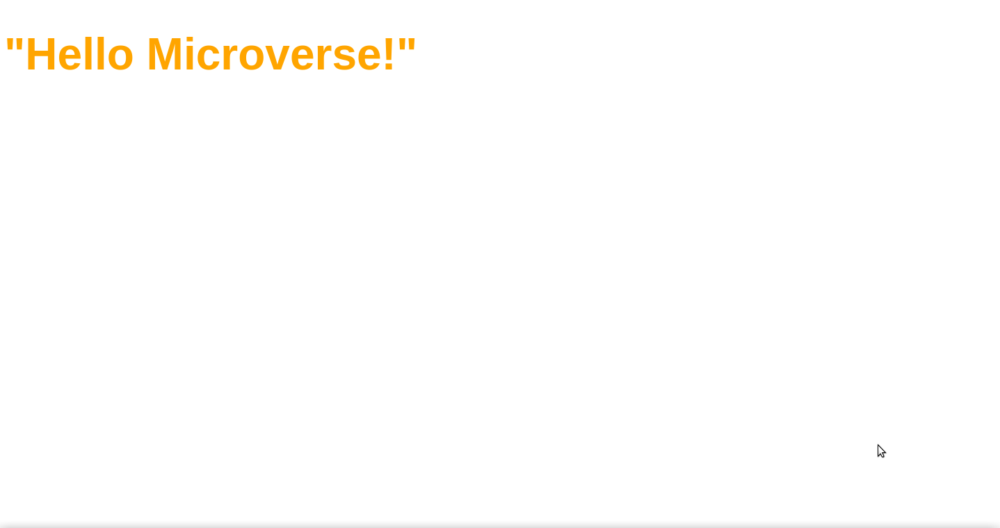

# Hello Microverse

> This is my first repository in the microverse technical curriculum.



This project contains a header styled with css.

## Built With

-HTML
-CSS

## Live Demo

[Live Demo Link](https://leboroz.github.io/Hello-Microverse/views)


## Getting Started


To get a local copy up and running follow these simple example steps.

### Prerequisites
  - Git installed

### Setup
  - open a terminal
  - run ``` git clone https://github.com/Leboroz/Hello-Microverse.git```
  - run ``` cd Hello-Microverse/views```
  - open index.html

## Authors

👤 **Leonardo Albornoz**

- GitHub: [@Leboroz](https://github.com/leboroz)
- Twitter: [@twitterhandle](https://twitter.com/leboroz)
- LinkedIn: [Leonardo Albornoz](https://www.linkedin.com/in/leonardo-albornoz-216784198/)

## 🤝 Contributing

Contributions, issues, and feature requests are welcome!

Feel free to check the [issues page](https://github.com/Leboroz/Hello-Microverse/issues).

## Show your support

Give a ⭐️ if you like this project!

## 📝 License

This project is [MIT](./MIT.md) licensed.
